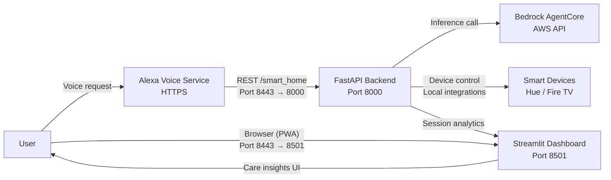

# CalmCompanion Architecture

_Port 8443 is terminated by the Caddy reverse proxy, forwarding to the FastAPI backend (8000) and Streamlit dashboard (8501). Smart devices are reached on their respective local adapters._
